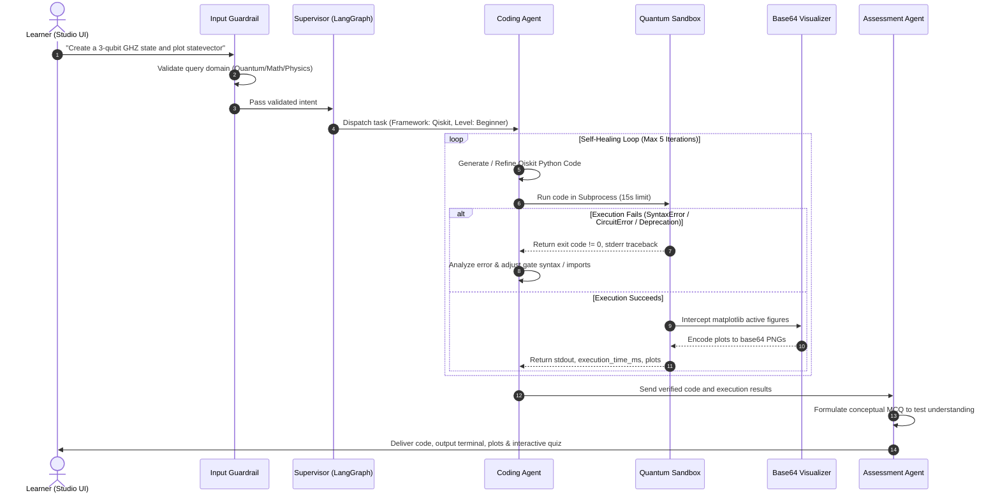
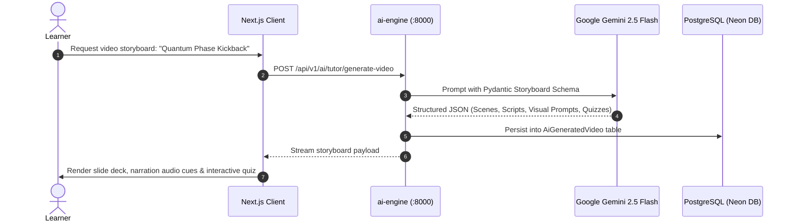
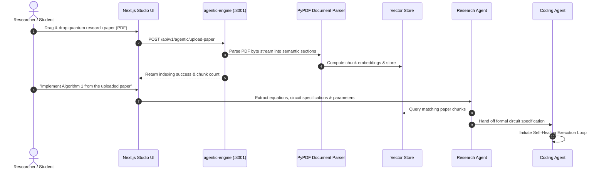

# QubitMinds™ — Complete System Architecture & Engineering Blueprint

> **QubitMinds** is an end-to-end cognitive quantum learning, simulation, and multi-agent research platform. It integrates visual quantum circuit engineering, autonomous multi-agent code generation and self-healing execution, real-time pedagogical AI tutoring, automated video storyboard synthesis, and comprehensive LMS gamification.

---

## 1. Architectural Principles & System Vision

QubitMinds is built upon five fundamental design tenets:
1. **Cognitive Pedagogical Grounding**: Abstract quantum mechanics (superposition, entanglement, phase kickback, decoherence) are rendered intuitive via interactive visual state representations (Bloch spheres, statevector amplitudes, probability histograms).
2. **Autonomous Multi-Agent Collaboration**: Complex quantum tasks are decomposed across specialized cognitive agents (Supervisor, Teacher, Coder, Assessor, Researcher) orchestrated by LangGraph.
3. **Deterministic Zero-Trust Guardrails**: Off-topic and malicious prompts are trapped and rejected deterministically *before* invoking any LLM, ensuring zero wasted tokens and zero model hijacking.
4. **Resilient Self-Healing Execution**: Quantum code generated by AI is executed in an isolated, headless sandbox that captures tracebacks and auto-repairs code up to 5 iterative cycles.
5. **Decoupled 6-Layer Topology**: Presentation, Gateway, AI, Multi-Agent Engine, Tool/MCP, and Persistence layers operate as loosely coupled services communicating via strongly typed contracts.

---

## 2. The 6-Layer QubitMinds Architecture Stack

```mermaid
flowchart TB
    subgraph L1 ["Layer 1: Cognitive Interaction & Presentation Layer (client/ - Next.js 14 @ :3000)"]
        Canvas["Interactive Quantum Canvas\n(Drag & Drop Gates, Transpiler, Bloch Sphere)"]
        Studio["Quantum Agent Studio\n(Multi-Agent Chat, Code Terminal, Plot Viewer)"]
        LMS_UI["LMS & Assessment Center\n(Curriculum, Quizzes, Coding Challenges)"]
        Portals["Role-Based Portals\n(Learner Dashboard · Instructor Studio · Admin Console)"]
        GamifyUI["Gamification Hub\n(XP, Levels, Daily Goals, Streak Tracking, Badges)"]
        ClientAuth["Auth State & Interceptor\n(Zustand Store, Silent Refresh on 401)"]
    end

    subgraph L2 ["Layer 2: Identity, Gateway & LMS Orchestration Layer (server/ - Express @ :5001)"]
        Gateway["Express Gateway & Rate Limiter"]
        AuthModule["Auth & Cryptographic Core\n(Argon2id, Dual-Token Rotation, Family Tracking)"]
        RBAC["3-Tier RBAC Guard\n(LEARNER, INSTRUCTOR, ADMIN)"]
        LMSModule["LMS & Curriculum Manager\n(Courses, Modules, Lessons, Enrollments, Submissions)"]
        ExpModule["Experiment & Simulation Hub\n(Circuit persistence, Metrics, Benchmarks)"]
        PrismaORM["Prisma Client ORM (6.4.1)"]
    end

    subgraph L3 ["Layer 3: Cognitive AI & Storyboard Service (ai-engine/ - FastAPI @ :8000)"]
        AIFastAPI["FastAPI App Core"]
        TutorService["Conversational Quantum Tutor\n(Grounding Contexts: General, Playground, Debug)"]
        StoryboardGen["Video Storyboard Generator\n(Structured Scene JSON, Voiceover, Checkpoint Quizzes)"]
        GenAISDK["Google GenAI SDK (gemini-2.5-flash)"]
        DirectDBSync["SQLAlchemy Telemetry Engine\n(AiChatHistory, AiGeneratedVideo)"]
    end

    subgraph L4 ["Layer 4: Autonomous Agentic Orchestration Layer (agentic-engine/ - FastAPI @ :8001)"]
        HardGuardrail["Zero-LLM Hard Guardrail\n(Deterministic Regex & Keyword Filtration)"]
        LangGraphSuper["Supervisor Coordinator (LangGraph)\n(Intent Classification & State Machine)"]
        subgraph AgentTeam ["Specialist Cognitive Agent Squad"]
            TeacherAgent["Teaching Agent\n(RAG Textbook Retrieval + Live Tavily Search)"]
            CodingAgent["Coding Agent\n(Qiskit / Cirq Synthesis & Self-Healing Loop)"]
            AssessmentAgent["Assessment Agent\n(Adaptive MCQs & Misconception Diagnosis)"]
            ResearcherAgent["Research / Paper Agent\n(PyPDF Ingestion & Algorithm Extraction)"]
        end
    end

    subgraph L5 ["Layer 5: Execution Sandbox & MCP Tooling Layer"]
        PySandbox["Quantum Python Sandbox\n(Subprocess Runner, 15s Timeout, Agg Plot Interceptor)"]
        MCPHub["Model Context Protocol (MCP) Client\n(qiskit-mcp-server, qiskit-docs-mcp-server via Stdio)"]
        VectorDB["Quantum RAG Vector Store\n(Section Chunks, Cosine Similarity, Embeddings)"]
        SimEngines["Simulation Engines\n(Qiskit Aer, Cirq, PennyLane, qBraid)"]
    end

    subgraph L6 ["Layer 6: Data, Memory & External Services Layer"]
        PostgresDB[("Neon Serverless PostgreSQL (SSL + Pooling)\n(Users, Auth Tokens, LMS, Experiments, Telemetry)")]
        ResendMail["Resend Email API\n(OTP Verification, Password Resets)"]
        GeminiCloud["Google Gemini Cloud API"]
        TavilyAPI["Tavily Quantum Web Search API"]
    end

    %% Interactions
    L1 -- "REST / HttpOnly Cookies" --> L2
    L1 -- "Tutor & Video Storyboard" --> L3
    L1 -- "Multi-Agent Workflows & RAG" --> L4

    L2 --> PrismaORM --> PostgresDB
    L2 --> ResendMail

    L3 --> GenAISDK --> GeminiCloud
    L3 --> DirectDBSync --> PostgresDB

    L4 --> HardGuardrail --> LangGraphSuper --> AgentTeam
    TeacherAgent --> VectorDB & TavilyAPI
    CodingAgent <--> PySandbox
    CodingAgent <--> MCPHub
    ResearcherAgent --> VectorDB
    AgentTeam --> GeminiCloud
    PySandbox --> SimEngines
```



---

## 3. End-to-End Operational Workflows

### 3.1. Autonomous Self-Healing Quantum Code Generation Loop

When a user asks QubitMinds to implement an algorithm (e.g., Grover's Search or Quantum Teleportation) or debug an existing circuit, the platform runs a closed-loop execution and self-healing sequence:



---

### 3.2. Automated Video Storyboard Generation Pipeline

The QubitMinds Storyboard Pipeline decomposes complex quantum concepts into multi-modal video lessons:



---

### 3.3. Research Paper Ingestion & Section RAG Workflow



---

## 4. Subsystem Specifications

### 4.1. Presentation Layer (`client/` — Next.js 14 App Router)
- **Directory**: `client/src/`
- **Core Technologies**: Next.js 14.2, React 18, Tailwind CSS, Zustand, Lucide React (`react-icons/lu`).
- **Port**: `3000`
- **Sub-Modules**:
  - **`app/playground/`**: Interactive canvas for dragging Pauli (X, Y, Z), Hadamard (H), Phase (S, T), Rotation ($R_x, R_y, R_z$), CNOT, and SWAP gates with live circuit JSON serialization.
  - **`app/ai-tutor/`**: Multi-agent Quantum Agent Studio with real-time thought logs, multi-iteration code diffs, interactive terminal stdout/stderr, base64 Matplotlib canvases, and paper uploaders.
  - **`app/(auth)/`**: High-contrast, responsive authentication suite (Login, Signup, Verify OTP, Reset Password).
  - **`app/instructor/`**: Instructor LMS studio for course authoring, module/lesson nesting, starter code creation, and automated test-case grading.
  - **`app/admin/`**: Governance portal for RBAC role elevation, user suspension, audit trail inspection, and backend health telemetry.

---

### 4.2. API Gateway & LMS Core (`server/` — Node.js / Express)
- **Directory**: `server/src/`
- **Core Technologies**: Node.js (ESM), Express 4.21, Prisma ORM 6.4, Argon2, JSON Web Tokens.
- **Port**: `5001`
- **Security & Data Handling**:
  - **Argon2id Hashing**: High-memory, GPU-resistant hashing for passwords and 6-digit OTP codes.
  - **Token Family Rotation**: Tokens carry a unique `familyId`. If an already-used or invalidated refresh token is presented, the server revokes the entire family, immediately mitigating token replay attacks.
  - **RBAC Hierarchy**:
    $$\text{LEARNER} \subset \text{INSTRUCTOR} \subset \text{ADMIN}$$
  - **Transparent Token Refresh Client**: `client/src/services/api.js` wraps standard `fetch` with HttpOnly cookie handling and single-flight 401 interception.

---

### 4.3. Generative AI Engine (`ai-engine/` — FastAPI)
- **Directory**: `ai-engine/app/`
- **Core Technologies**: Python 3.11+, FastAPI, Uvicorn, Google GenAI SDK, SQLAlchemy.
- **Port**: `8000`
- **Services**:
  - **Conversational Tutor** (`/api/v1/ai/tutor/chat`): Provides context-grounded pedagogical explanations adapting to beginner, intermediate, or advanced learners.
  - **Video Storyboard Engine** (`/api/v1/ai/tutor/generate-video`): Transforms queries into structured multi-scene video blueprints containing slide visual elements, voice narration scripts, and checkpoint questions.
  - **Telemetry Logging**: Asynchronously writes conversations and generated multimedia records directly into PostgreSQL.

---

### 4.4. Agentic Quantum Engine (`agentic-engine/` — FastAPI + LangGraph)
- **Directory**: `agentic-engine/app/`
- **Core Technologies**: Python 3.11+, FastAPI, LangGraph, Qiskit 1.x, Cirq, Tavily, PyPDF.
- **Port**: `8001`
- **Component Breakdown**:
  - **`core/guardrails.py`**: Deterministic short-circuit validator that filters out-of-domain queries without invoking the LLM.
  - **`agents/supervisor.py`**: LangGraph graph coordinator managing the state machine and dynamic routing between specialist agents.
  - **`agents/coder.py`**: Circuit synthesis engine utilizing Qiskit or Cirq, wired to the self-healing debug cycle.
  - **`execution/sandbox.py`**: Subprocess runner executing code in isolated temporary directories with automatic Matplotlib plot interception and 15-second execution timeout.
  - **`mcp/client.py`**: Model Context Protocol client communicating with vendored `qiskit-mcp-server` and `qiskit-docs-mcp-server` via stdio.
  - **`rag/`**: Ingestion and cosine similarity vector index for quantum literature and PDF research papers.

---

## 5. Security & Threat Modeling Matrix

| Component | Threat Scenario | Mitigation Architecture |
| :--- | :--- | :--- |
| **Authentication** | Session hijacking via script access | Access & refresh tokens stored exclusively in `HttpOnly`, `SameSite=Lax`, `Secure` cookies. |
| **Token Theft** | Stolen refresh token replay | Token Family Rotation with `familyId`. Reusing a spent token revokes all associated tokens. |
| **Sandbox Execution** | Malicious system calls or infinite loops | Isolated subprocesses with 15s hard timeout, headless `Agg` display, sanitized unicode input, and scoped execution directories. |
| **AI LLM Interface** | Prompt injection / Token drain attacks | Zero-LLM deterministic input guardrails reject off-topic and malicious prompts *before* LLM invocation. |
| **API Endpoints** | Brute force login / OTP guessing | Rate limiting (`express-rate-limit`) and maximum 5-attempt threshold per OTP record. |
| **Database** | SQL Injection & Data Exposure | Prisma ORM & SQLAlchemy parameterized queries with SSL-enforced Neon DB connections. |

---

## 6. Network Topology & Service Communication Map

```
                                  [ Browser Client ]
                                           |
                    +----------------------+----------------------+
                    | (Port 3000)                                 | (Port 3000)
             [ Next.js Client ]                            [ Next.js Client ]
                    |                                             |
            HttpOnly Cookies                              REST JSON APIs
             (:5001 Express)                               (:8000 & :8001)
                    v                                             v
        +-----------------------+                    +-------------------------+
        |  server/ Gateway      |                    |   ai-engine / :8000     |
        |  - Auth & RBAC        |                    |   - Tutor Chat          |
        |  - LMS Core           |                    |   - Video Storyboards   |
        |  - Prisma ORM         |                    +-------------------------+
        +-----------+-----------+                                 |
                    |                                             |
                    |                                             |
                    v                                             v
        +----------------------------------------------------------------------+
        |              Neon Serverless PostgreSQL (SSL Pooled)                |
        |  (Users, Tokens, LMS, Experiments, Simulations, AiHistory)          |
        +----------------------------------------------------------------------+
                                           ^
                                           |
                                   REST JSON APIs
                                           |
                             +-----------------------------+
                             |   agentic-engine / :8001    |
                             |   - LangGraph Supervisor    |
                             |   - Self-Healing Coder      |
                             |   - PySandbox Execution     |
                             |   - Stdio MCP Server Client |
                             +-----------------------------+
```

---

## 7. Operational Runbook

| Service | Directory | Command | Port | Responsibilities |
| :--- | :--- | :--- | :--- | :--- |
| **Frontend Client** | `client/` | `npm run dev` | `3000` | UI, Canvas, Portals, Agent Studio |
| **API Gateway** | `server/` | `npm run dev` | `5001` | Auth, RBAC, LMS, Persistence |
| **AI Engine** | `ai-engine/` | `uvicorn app.main:app --port 8000` | `8000` | Tutor, Storyboards, DB Sync |
| **Agentic Engine** | `agentic-engine/` | `uvicorn app.main:app --port 8001` | `8001` | Multi-Agent Team, Sandbox, MCP |
