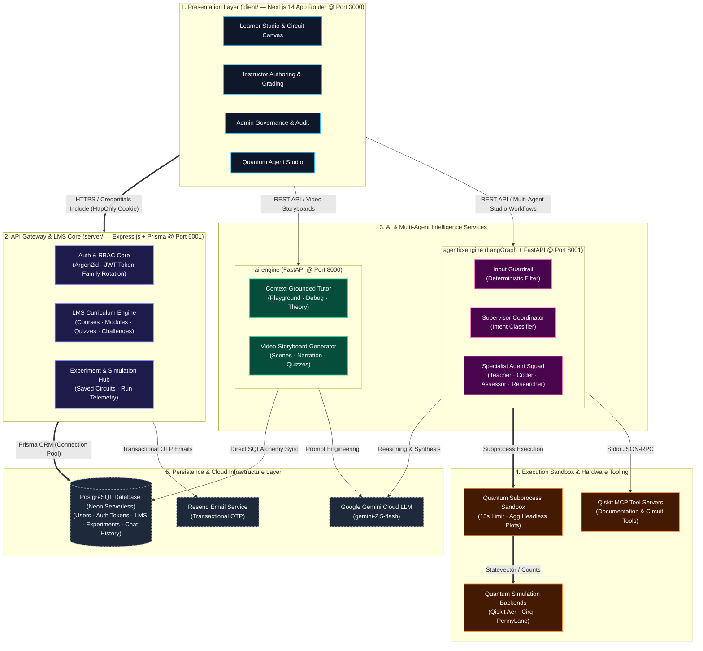
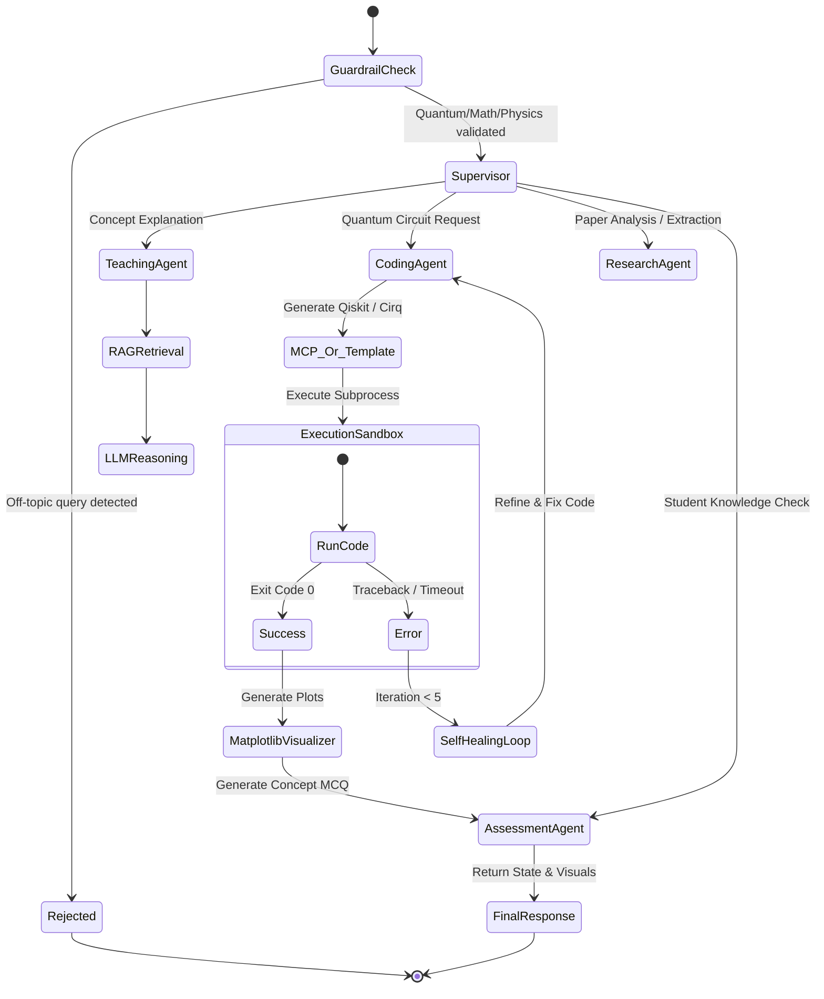
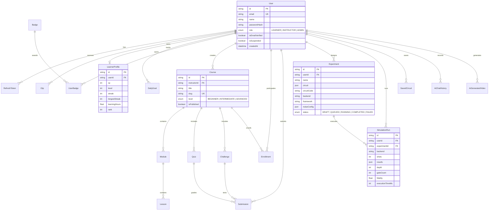

# Quantum Learning Platform — System Architecture Design

## 1. Executive Summary

The **Quantum Learning Platform** is a distributed, cloud-ready educational and research ecosystem designed to bridge theoretical quantum computing, interactive simulation, autonomous AI-assisted learning, and laboratory experimentation.

The platform is structured into four decoupled, specialized tiers:
1. **Presentation & Interactive Client (`client/` — Next.js 14 App Router on `:3000`)**
2. **Core API Gateway & LMS Backend (`server/` — Express + Prisma on `:5001`)**
3. **Generative AI & Multimedia Storyboard Service (`ai-engine/` — FastAPI on `:8000`)**
4. **Autonomous Multi-Agent Quantum Execution Engine (`agentic-engine/` — LangGraph + MCP on `:8001`)**

Data persistence is consolidated via **PostgreSQL (Neon DB)** with SSL connection pooling, alongside a vector database index for quantum literature RAG.

---

## 2. High-Level System Architecture Diagram



---

## 3. Subsystem Deep-Dive

### 3.1. Frontend Architecture (`client/`)
- **Framework**: Next.js 14 App Router with React 18, Tailwind CSS, Lucide icons (`react-icons/lu`), and Zustand.
- **Role Portals**:
  - **Learner**: `/dashboard`, `/learn` (courses/modules), `/playground` (interactive drag-and-drop circuit canvas & live transpiler), `/challenges` (quantum code challenges), `/ai-tutor` (Quantum Agent Studio), `/progress` & `/profile`.
  - **Instructor**: `/instructor` (curriculum authoring, quiz/challenge builder, automated submission grading queue, student analytics).
  - **Admin**: `/admin` (user lifecycle management, role elevation, moderation, backend diagnostics, platform audit logs).
- **Session Transport & Token Lifecycle**:
  - HttpOnly cookie transport via `credentials: 'include'`.
  - `apiFetch` wrapper handles transparent 401 interception: whenever an access token expires, it silently requests `/api/auth/refresh`, deduplicating parallel refreshes via a single active promise before replaying failed requests.

---

### 3.2. Backend API Gateway (`server/`)
- **Runtime**: Node.js in strict ES Modules mode (`"type": "module"`).
- **Core Responsibilities**:
  - **Authentication & Security**: Argon2id hashing for passwords and OTP codes; JWT signing for short-lived access tokens (15m) and persistent refresh tokens (7d).
  - **Token Rotation & Replay Protection**: Refresh tokens are grouped by `familyId`. If a revoked or previously used token is presented, the entire family is revoked, neutralizing token theft.
  - **Role-Based Access Control (RBAC)**: Enforced through `authenticateUser` and `authorizeRoles('LEARNER', 'INSTRUCTOR', 'ADMIN')` middleware.
  - **LMS Engine**: Courses, modules, interactive lessons, starter code distribution, and challenge submissions.
  - **Gamification Subsystem**: XP accrual, level computation, daily challenge streak counters, and badge unlocks.
  - **Experiment Persistence**: Manages `Experiment` and `SimulationRun` records capturing circuit JSON, noise profiles, shot counts, execution times, depth, gate counts, and statevectors.

---

### 3.3. AI Engine (`ai-engine/`)
- **Runtime**: FastAPI with Python 3.11+, Uvicorn ASGI server on port `8000`.
- **LLM Integration**: Google GenAI SDK (`gemini-2.5-flash` with graceful fallback to `gemini-1.5-flash`).
- **Capabilities**:
  - **Context-Grounded Tutor**: Handles pedagogical quantum queries tailored to active workspace contexts (`general`, `playground`, `debugging`, `algorithm`).
  - **Automated Video Storyboard Generator**: Converts quantum computing topics into full multimedia lesson blueprints containing slide-by-slide visual layout specs, script narration, visual prompt cues, and embedded checkpoints.
  - **Direct Telemetry Persistence**: Uses SQLAlchemy to write directly to the shared PostgreSQL schema (`AiChatHistory`, `AiGeneratedVideo`).

---

### 3.4. Agentic Quantum Engine (`agentic-engine/`)
- **Runtime**: FastAPI + LangGraph state machine on port `8001`.
- **Closed-Loop Paradigm**:
  $$\text{Input Guardrail} \rightarrow \text{Supervisor} \rightarrow \text{Code/Teach/Research} \rightarrow \text{Execution Sandbox} \rightarrow \text{Self-Healing Debugger} \rightarrow \text{Assessment}$$



- **Specialized Agent Roster**:
  1. **Input Guardrail** (`core/guardrails.py`): Zero-LLM deterministic filter blocking non-quantum inquiries (weather, sports, politics) with zero latency and zero token burn.
  2. **Supervisor** (`agents/supervisor.py`): LangGraph coordinator evaluating user intent, student proficiency (`Beginner`, `Intermediate`, `Advanced`), and dynamic task routing.
  3. **Teaching Agent** (`agents/teacher.py`): Grounded explanations leveraging local vector search and live Tavily web search.
  4. **Coding Agent with Self-Healing Loop** (`agents/coder.py`): Emits executable Qiskit or Cirq Python code, executes it in a sandboxed subprocess (`EXECUTION_TIMEOUT_SECONDS=15`), inspects `stderr`, and autonomously refines code up to `MAX_DEBUG_ITERATIONS=5`.
  5. **Assessment Agent** (`agents/assessor.py`): Diagnoses conceptual traps and misconceptions based on student MCQ interactions.
  6. **Research Agent** (`agents/researcher.py`): Ingests PDF research papers using `pypdf`, builds section embeddings, and synthesizes circuit implementations from published literature.
- **Model Context Protocol (MCP)**: Communicates with local Qiskit MCP servers via stdio for direct circuit manipulation, quantum volume benchmarks, and API documentation lookup.

---

## 4. Comprehensive Database Entity Relationship Model



---

## 5. Security Architecture & Threat Mitigation

| Threat Vector | Mitigation Strategy Implemented | Subsystem |
| :--- | :--- | :--- |
| **Credential Theft & Replay** | Argon2id hashing; HttpOnly SameSite cookies; short-lived access JWT (15m). | `server/` |
| **Refresh Token Interception** | Token family rotation (`familyId`). Reuse of an already-consumed token invalidates the entire token family immediately. | `server/` |
| **Privilege Escalation** | Two-tier RBAC guards at Express router level (`authorizeRoles`) and Next.js client guards (`ProtectedRoute`). | `server/` & `client/` |
| **Prompt Injection / Jailbreaks** | Hard short-circuit Input Guardrail rejecting off-topic prompts *prior* to LLM invocation. | `agentic-engine/` |
| **Arbitrary Code Execution in Agent Sandbox** | Subprocess execution with hard 15-second timeouts, resource bounds, dedicated output buffers, and restricted imports. | `agentic-engine/` |
| **DDoS & Brute Force** | Rate limiting (`express-rate-limit`) on sensitive auth and OTP endpoints; OTP attempt counters (max 5). | `server/` |

---

## 6. Network Topology & Ports

```
                          [ Internet / Browser ]
                                     |
               +---------------------+---------------------+
               | (Port 3000)                               | (Port 3000)
      [ Next.js Client ]                                  [ Next.js Client ]
               |                                                   |
      HTTP / Cookies (:5001)                           HTTP REST (:8000 & :8001)
               v                                                   v
      [ Express API Gateway ]                    +-----------------+-----------------+
               |                                 |                                   |
         (Prisma ORM)                      [ ai-engine :8000 ]             [ agentic-engine :8001 ]
               |                                 |                                   |
               |                                 | (Direct DB Sync)                  | (Subprocess / Stdio)
               v                                 v                                   v
    [ PostgreSQL (Neon DB) ] <-------------------+                         [ Qiskit MCP Servers & Sandbox ]
```

---

## 7. Operational Workflow Matrix

1. **Learner Experimentation Flow**:
   User creates circuit in Next.js Drag-and-Drop Canvas $\rightarrow$ Client sends simulation request to Express `:5001` $\rightarrow$ Simulation run is recorded in PostgreSQL $\rightarrow$ Circuit transpiles to Qiskit Aer / PennyLane / Cirq $\rightarrow$ Results (Bloch vectors, probabilities, gate counts) returned to UI.
2. **Autonomous Agentic Troubleshooting Flow**:
   User encounters an algorithm bug $\rightarrow$ Agent Studio triggers `:8001/api/v1/agentic/chat` $\rightarrow$ Guardrail passes $\rightarrow$ Supervisor identifies debugging intent $\rightarrow$ Coding Agent initiates execution loop $\rightarrow$ Sandboxed runner detects runtime error $\rightarrow$ Agent self-heals up to 5 times $\rightarrow$ Output plot and statevector visual rendered as base64 and returned with diagnostic MCQ.
3. **Multimedia Video Storyboard Generation**:
   User requests interactive video summary $\rightarrow$ Client triggers `:8000/api/v1/ai/tutor/generate-video` $\rightarrow$ AI Engine queries Gemini with structured schema $\rightarrow$ Generates multi-scene JSON containing narration, slide graphics, and interactive checkpoint $\rightarrow$ Storyboard recorded in PostgreSQL and streamed to user.
